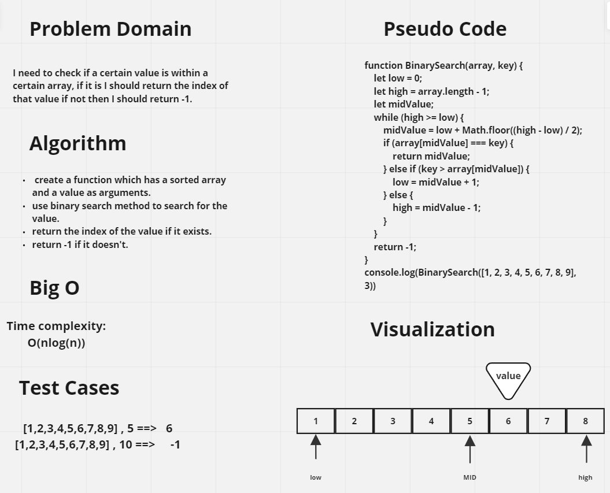

# Challenge Title
Code Challenge: Class 02

## Whiteboard Process

## Approach & Efficiency

 O(nlogn)

## Solution

function BinarySearch(array,key){
  let low = 0;
  let high = array.length -1;
  let midValue;
  while(high >= low){
    midValue = low + Math.floor((high-low)/2);
    if(array[midValue] === key){
      return midValue;
    } else if(key > array[midValue]){
      low = midValue + 1;
    } else {
      high = midValue -1;
    }
  }
  return -1;
} 
console.log(BinarySearch([1,2,3,4,5,6,7,8,9],3))