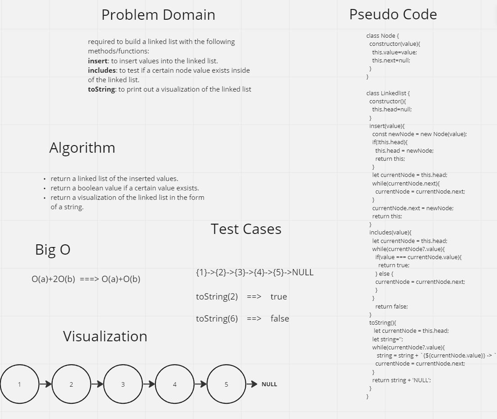

# Challenge Title
Code Challenge: Class 05: Linked list implementation

## Whiteboard Process

## Approach & Efficiency

## Solution

class Node {
  constructor(value){
    this.value=value;
    this.next=null;
  }
}

class Linkedlist {
  constructor(){
    this.head=null;
  }
  insert(value){
    const newNode = new Node(value);
    if(!this.head){
      this.head = newNode;
      return this;
    }
    let currentNode = this.head;
    while(currentNode.next){
      currentNode = currentNode.next;
    }
    currentNode.next = newNode;
    return this;
  }
  includes(value){
    let currentNode = this.head;
    while(currentNode?.value){
      if(value === currentNode.value){
        return true;
      } else {
      currentNode = currentNode.next;
      }
    }
      return false;
  }
  toString(){
     let currentNode = this.head;
    let string='';
    while(currentNode?.value){
       string = string + `{${currentNode.value}} -> `;
      currentNode = currentNode.next;
    }
    return string + 'NULL';
  }
}

const ll = new Linkedlist();
ll.insert(1)
ll.insert(2)
ll.insert(3)
ll.insert(4)
ll.insert(5)

console.log(ll)
console.log(ll.includes(6))
console.log(ll.toString())