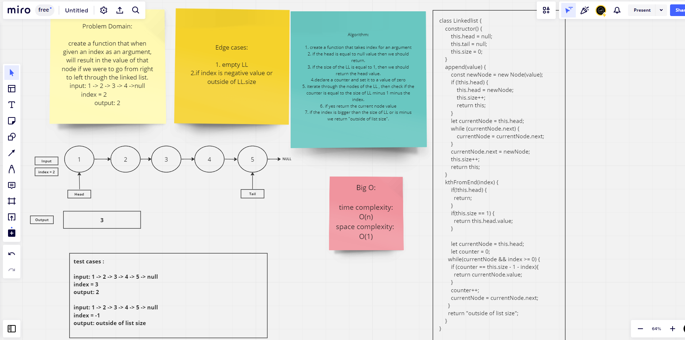

# Challenge Title

Code Challenge: Class 06

## Whiteboard Process

## Approach & Efficiency

## Solution
'use strict';

class Node {
    constructor(value) {
        this.value = value;
        this.next = null;
    }
}

class Linkedlist {
    constructor() {
        this.head = null;
        this.tail = null;
        this.size = 0;
    }
    append(value) {
        const newNode = new Node(value);
        if (!this.head) {
            this.head = newNode;
            this.size++;
            return this;
        }
        let currentNode = this.head;
        while (currentNode.next) {
            currentNode = currentNode.next;
        }
        currentNode.next = newNode;  
        this.size++;
        return this;
    }
    kthFromEnd(index) {
        if(!this.head) {
          return;
        }
        if(this.size == 1) {
          return this.head.value;
        }
      
        let currentNode = this.head;
        let counter = 0;
      while(currentNode && index >= 0) {
        if (counter == this.size - 1 - index){
          return currentNode.value;
        }
        counter++;
        currentNode = currentNode.next;
      }
      return "outside of list size";
    }
    toString(){
    let currentNode = this.head;
    let string='';
    while(currentNode?.value){
       string = string + `{${currentNode.value}} -> `;
      currentNode = currentNode.next;
    }
    return string + 'NULL';
    }
}
const ll = new Linkedlist();

ll.append(1);
ll.append(2);
ll.append(3);
ll.append(4);
ll.append(5);

console.log(ll.kthFromEnd(0))

console.log(ll.size)
console.log(ll.toString())
