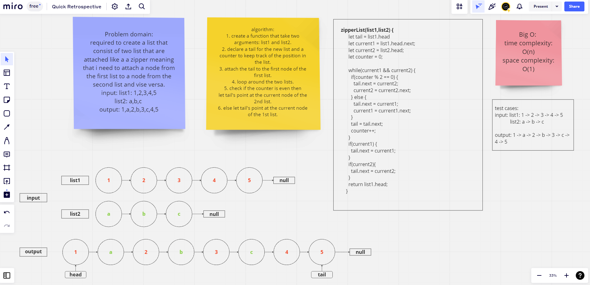

# Challenge Title

Code Challenge: Class 07

## Whiteboard Process

## Approach & Efficiency

## Solution

'use strict';

class Node {
    constructor(value) {
        this.value = value;
        this.next = null;
    }
}

class Linkedlist {
    constructor() {
        this.head = null;
        this.tail = null;
        this.size = 0;
    }
    append(value) {
        const newNode = new Node(value);
        if (!this.head) {
            this.head = newNode;
            this.size++;
            return this;
        }
        let currentNode = this.head;
        while (currentNode.next) {
            currentNode = currentNode.next;
        }
        currentNode.next = newNode;  
        this.size++;
        return this;
    }
    zipperList(list1,list2) {
      let tail = list1.head
      let current1 = list1.head.next;
      let current2 = list2.head;
      let counter = 0;
      
      while(current1 && current2) {
        if(counter % 2 == 0) {
          tail.next = current2;
          current2 = current2.next;
        } else {
          tail.next = current1;
          current1 = current1.next;
        }
        tail = tail.next;
        counter++;
      }
      if(current1) {
        tail.next = current1;
      }
      if(current2){
        tail.next = current2;
      }
      return list1.head;
    }
    toString(){
    let currentNode = this.head;
    let string='';
    while(currentNode?.value){
       string = string + `{${currentNode.value}} -> `;
      currentNode = currentNode.next;
    }
    return string + 'NULL';
    }
}
const ll = new Linkedlist();
const ll2 = new Linkedlist();

ll2.append('a');
ll2.append('b');
ll2.append('c');

ll.append(1);
ll.append(2);
ll.append(3);
ll.append(4);
ll.append(5);

console.log(ll2.zipperList(ll,ll2))

console.log(ll.toString())
